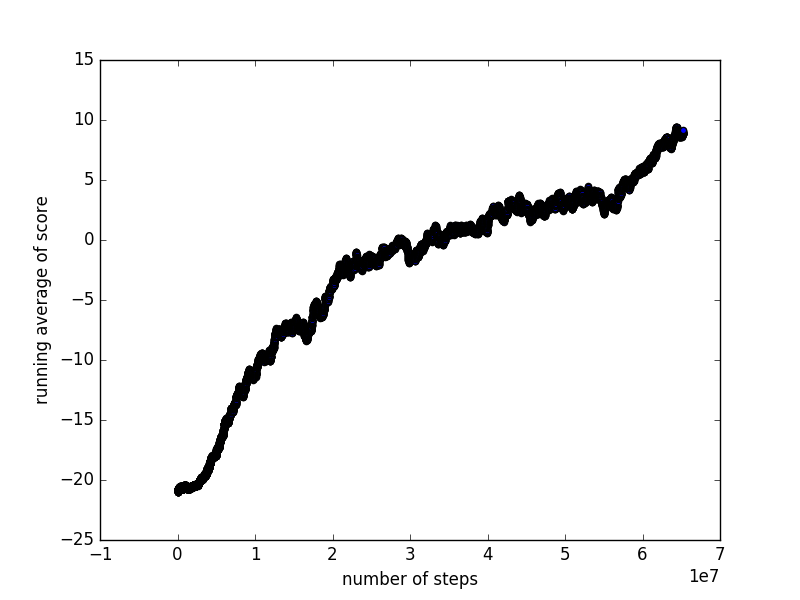

IE598 project: deep reinforcement learning on Atari games
==========================

## Requirements

- chainer

- OpenAI Gym

## Method

We used A3C (asynchronous advantage actor-critic method) with LSTM (long short-term memory) to train the model.  See https://arxiv.org/pdf/1602.01783.pdf for more information. 

## Example output

We ran A3C method with LSTM on Atari pong game for 65 million steps (41 hours).  Here is the graph of running average of scores vs. number of steps:

You may also see here for videos:

// TODO

## 

## Similar github repositories

- https://github.com/coreylynch/async-rl

- https://github.com/matthiasplappert/keras-rl

- https://github.com/ppwwyyxx/tensorpack/tree/master/examples/OpenAIGym

- https://github.com/muupan/async-rl

- https://github.com/miyosuda/async_deep_reinforce

